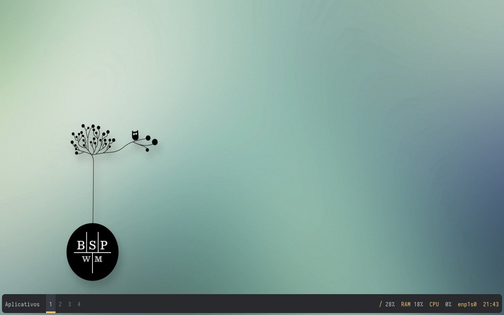

# BSPWM (Gerenciador de janelas)
```
Notas Importantes:
- Backup do sistema através dos arquivos de configuração 
- Procedimentos deve ser feito após uma instalação base (debian) .
```


### 1 - instalação (Gerenciador + Ambiente de trabalho mínimo)
```
sudo apt install xorg xinit bspwm xfce4-terminal git vim rofi polybar pulseaudio feh
```
### 2 - Configuração através do home
```
cd ; git clone https://github.com/wsalmeida11/bspwm
cp -r ~/bspwm/home/.* ~/ ; cp -r ~/bspwm/home/* ~/
```
### 3 - Instalação e configuração (script)
```
... Script em construção
```
